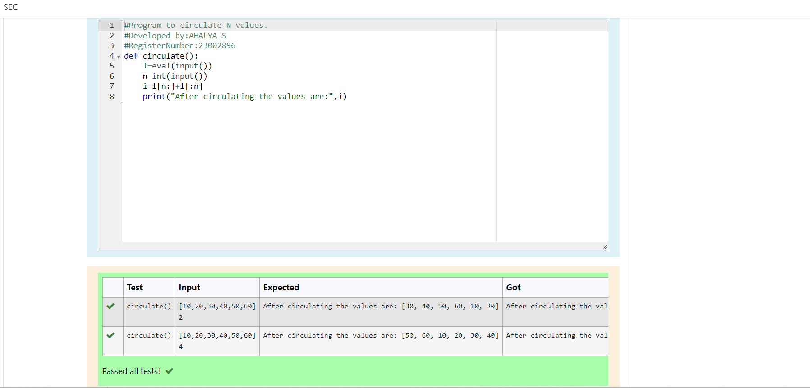

# Circulate-the-values-of-N-variables
## Aim:
To write a python program to circulate the n variables using function concept
## Equipment’s required:
PC
Anaconda - Python 3.7
## Algorithm: 
### Step 1: 
Get the values from the user
### Step 2:
get the input
### Step 3: 
Get the value from the user for the number of rotation
### Step 4: 
Using the slicing concept rotate the list
### Step 5: 
print the values it would be interchanged
### Step 6: 
end the program
## Program:
"""
# program to circulate N values.
# Developed by: AHALYA S
# RegisterNumber:23002896
def circulate():
     l=eval(input())
     n=int(input())
     l=l[n: ]+l[ :n]
     print("After circulating the values are:",l)
"""

## Output:

## Result:
Completed successfully
